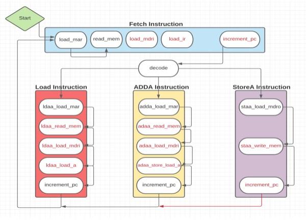

# simple-cpu
This repository contains the VHDL code for a very simple CPU I created for my Digital Logic Design class's final project.   
The CPU has 3 basic operations it can perform:   
- Load from memory into accumulator
- Add into accumulator
- Store to memory from accumulator

This design conforms the following state machine:   

# Explanation on the functionality of each VHDL component   
## CPU.vhd
The VHDL code in this file represents a simple CPU. The CPU is composed of several
components, including a memory unit, an arithmetic logic unit (ALU), registers, a program
counter, a multiplexer, and a control unit.
The memory unit is an 8x32 memory component, where each memory cell can store an 8-bit
value, and there are 32 cells in total, addressable by a 5-bit address. The memory unit supports
read and write operations, controlled by the Read_Addr, Data_in, Data_out, and Write_Enable
signals.
The ALU performs arithmetic and logic operations, taking two 8-bit inputs (A and B) and a 3-bit
operation code (AluOp), and produces an 8-bit output. The ALU is connected to the accumulator
register, which temporarily stores the results of ALU operations.
Registers in the design include the accumulator, instruction register (IR), memory address
register (MAR), memory data register input (MDRI), and memory data register output (MDRO).
These registers are used to store values temporarily as the CPU processes instructions.
The program counter is responsible for sequentially keeping track of the memory address of the
next instruction to be executed
The MAR multiplexer (MarMux) is used to select between the program counter output and the
IR's lower 5 bits as the address input for the memory access register (MAR).
The control unit takes an OpCode from the instruction register (IR) and, based on the operation
code, generates control signals that determine the operation of the CPU components. These
control signals include load signals for the accumulator, MAR, IR, MDRI, and MDRO registers,
increment signal for the program counter, selection signal for the MAR mux, write enable signal
for the memory unit, and ALU operation code.
The provided connections in the code interconnect
these components, enabling data and control signals
to flow between them as required by the operation
being executed. The outputs of the CPU include
pcOut, marOut, irOutput, mdriOutput, mdroOutput,
aOut, and incrementOut. These are connected to
respective internal signals in the CPU, providing
visibility into its current state.   

## ProgramCounter.vhd
This VHDL code represents a simple 5-bit program counter, a key component in a CPU that is
responsible for keeping track of the memory address of the next instruction to be executed. The
program counter has three ports: output, clk, and increment.
- output: A 5-bit std_logic_vector output signal that represents the current value of the
program counter.
- clk: A std_logic input signal representing the clock signal, which is used to synchronize
the operation of the program counter with other components of the CPU.
- increment: A std_logic input signal, when set to '1', increments the program counter by 1
on the rising edge of the clock signal.

The architecture behavior of the ProgramCounter consists of a single process sensitive to the
clock (clk) signal. The process uses a variable named 'counter' initialized to 0 to keep track of the
current value of the program counter. The process runs whenever there is an event on the clock
signal (i.e., a rising or falling edge of the clock).
When the process detects a rising edge on the clock signal (clk'event and clk = '1') and the
increment signal is set to '1', the program counter increments its value by 1. The incremented
value is then assigned to the 'output' signal after converting the integer counter value to an
unsigned 5-bit std_logic_vector using the 'to_unsigned' function from the numeric_std library.

## Reg.vhd
This VHDL code represents a simple 8-bit register, an essential building block in digital systems
that is used to temporarily store data. The register has four ports: clk, load, input, and output.
- clk: A std_logic input signal representing the clock signal, which is used to synchronize
the operation of the register with other components in the system.
- load: A std_logic input signal, when set to '1', loads the value from the input port into the
register on the rising edge of the clock signal.
- input: An 8-bit std_logic_vector input signal that represents the data to be loaded into the
register.
- output: An 8-bit std_logic_vector output signal that represents the current value stored in the
register.    
  
The architecture behavior of the register consists of a single process sensitive to the clock (clk)
and load signals. The process runs whenever there is an event on the clock or load signal (i.e., a
rising or falling edge).
When the process detects a rising edge on the clock signal (clk'event and clk = '1') and the load
signal is set to '1', the value from the input port is loaded into the register, and the output signal is
assigned the value of the input signal.

## MarMux.vhd
This VHDL code represents a simple 5-bit 2-to-1 multiplexer (mux) for the Memory Address
Register (MAR). A multiplexer is a combinational circuit that selects one of multiple inputs and
forwards the selected input to a single output. The MarMux has four ports: A, B, address, and
output.
- A: A 5-bit std_logic_vector input signal that represents the first input option.
- B: A 5-bit std_logic_vector input signal that represents the second input option.
- address: A std_logic input signal, which is used as the selection signal for the
multiplexer. If it is '0', the output is assigned the value of input A; if it is '1', the output is
assigned the value of input B.
- output: A 5-bit std_logic_vector output signal that represents the selected input value
based on the address signal.

The architecture behavior of the MarMux consists of a single process sensitive to the A, B, and
address signals. The process runs whenever there is an event on any of these signals (i.e., a
change in their values).
The process checks the value of the address signal. If the address signal is '0', the output is
assigned the value of input A. If the address signal is '1', the output is assigned the value of input
B.

## Memory_8_by_32.vhd
This VHDL code represents an 8-bit wide by 32-byte memory component, which serves as a
storage device for data in digital systems. The memory component has five ports: clk, read_addr,
data_in, write_enable, and data_out.
- clk: A std_logic input signal representing the clock signal, which is used to synchronize
the operation of the memory component with other components in the system.
- read_addr: A 5-bit std_logic_vector input signal that represents the read address for the
memory. This address is used to access the corresponding data stored in the memory.
- data_in: An 8-bit std_logic_vector input signal that represents the data to be written into
the memory when the write_enable signal is set to '1'.
- write_enable: A std_logic input signal that controls the write operation. When set to '1',
the data_in value is written to the memory location specified by the read_addr; when set
to '0', the memory performs a read operation.
- data_out: An 8-bit std_logic_vector output signal that represents the data read from the
memory at the specified read_addr.

The memory component's architecture behavior consists of a process sensitive to the clock (clk)
and write_enable signals. The process runs whenever there is an event on the clock or
write_enable signal (i.e., a rising or falling edge).
When the process detects a rising edge on the clock signal (clk'event and clk = '1') and the
write_enable signal is set to '0', a read operation is performed. The data_out signal is assigned the
value stored in the memory at the location specified by the read_addr.
When the process detects a rising edge on the clock signal (clk'event and clk = '1') and the
write_enable signal is set to '1', a write operation is performed. The data_in value is written to the
memory location specified by the read_addr.
In relation to the MAR and MarMux components, the read_addr input of the memory component
is typically connected to the output of the MAR (Memory Address Register). The MAR stores
the address for the memory access operation. The MarMux is used to select the source of the
memory address (such as the Program Counter or an immediate value from the Instruction
Register) before loading it into the MAR. The MarMux output is then connected to the MAR's
input, which ultimately feeds into the memory component's read_addr input.

## ALU.vhd
This VHDL code represents an Arithmetic Logic Unit (ALU), which is a fundamental
component in digital systems responsible for performing various arithmetic and logic operations.
The ALU has four ports: AluOp, A, B, and output.
- AluOp: A 3-bit std_logic_vector input signal representing the operation code that
determines which arithmetic or logic operation the ALU should perform.
- A: An 8-bit std_logic_vector input signal representing the first operand for the ALU
operation.
- B: An 8-bit std_logic_vector input signal representing the second operand for the ALU
operation.
- output: An 8-bit std_logic_vector output signal that represents the result of the operation
performed by the ALU.

The ALU's architecture behavior consists of a process sensitive to the A, B, and AluOp signals.
The process is triggered when any of these signals change, and it determines the operation to
perform based on the AluOp signal's value.   
The ALU can perform the following operations based on the value of AluOp:
- "000": Addition - The ALU adds the values of A and B, and the result is assigned to the
output signal.
- "001": Subtraction - The ALU subtracts the value of B from A, and the result is assigned
to the output signal.
- "010": AND - The ALU performs a bitwise AND operation between A and B, and the
result is assigned to the output signal.
- "011": OR - The ALU performs a bitwise OR operation between A and B, and the result
is assigned to the output signal.
- "100": Pass B - The ALU passes the value of B directly to the output signal.
- "101": Pass A - The ALU passes the value of A directly to the output signal.

The ALU plays a crucial role in the overall operation of a digital system or CPU, as it is
responsible for executing various arithmetic and logic instructions based on the values of its
input operands and the operation code provided by the control unit.

## ControlUnit.vhd
The VHDL code in this file represents a Control Unit (CU), which is an essential component of a
digital system or a CPU, responsible for coordinating and synchronizing the operations of other
components, such as memory, ALU, and registers.   
The Control Unit has 11 ports:
- OpCode: A 3-bit std_logic_vector input signal representing the operation code that
determines the instruction to execute.
- clk: A std_logic input signal representing the clock input to synchronize the CU's
operation.
- ToALoad, ToMarLoad, ToIrLoad, ToMdriLoad, ToMdroLoad: std_logic output signals
that control the loading of registers (A, MAR, IR, MDRI, and MDRO) within the CPU.
- ToPcIncrement: A std_logic output signal that controls the increment of the program
counter (PC).
- ToMarMux: A std_logic output signal that controls the input selection for the MAR.
- ToRamWriteEnable: A std_logic output signal that controls the write enable for the
memory (RAM).
- ToAluOp: A 3-bit std_logic_vector output signal that provides the operation code for the
ALU.

The CU's architecture consists of a state machine that determines the current state of the CU and
a process sensitive to the current state to set output signals accordingly. The state machine is
clock-sensitive and implements several states, such as load_mar, read_mem, load_mdri, load_ir,
decode, ldaa_load_mar, and adaa_load_mar, to represent the various stages of instruction
execution in a digital system or CPU.
For each state in the process, the appropriate output signals are set based on the requirements of
that state. For instance, in the ldaa_load_mar state, the ToALoad, ToPCIncrement, ToMarMux,
ToMarLoad, ToRamWriteEnable, ToMdriLoad, ToIrLoad, ToMdroLoad, and ToAluOp signals
are set to the respective values required for this state.
The Control Unit's role is to generate the necessary control signals to orchestrate the operation of
the entire digital system or CPU, ensuring that all components work together to execute
instructions accurately and efficiently.
